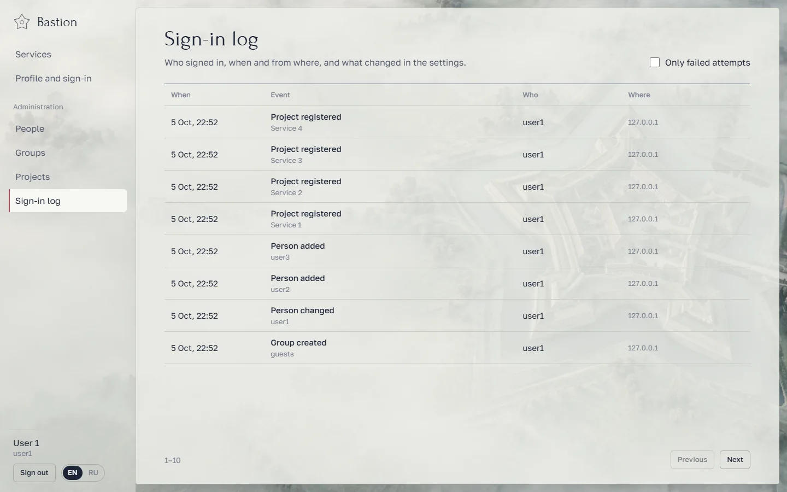

# Bastion

Свой сервер входа для домашней цитадели. Один раз заводите людей, группы и проекты, люди один раз привязывают
телефон, и дальше во все сервисы входят одним логином, паролем и кодом из Google Authenticator.


## Что умеет

- **Люди и группы.** Добавить человека, задать пароль, выдать группы, отключить вход, отвязать телефон, завершить
  все сеансы. Группа работает как пропуск: проекту указываете группы, и пускают только их участников.
- **Код из приложения для всех.** При первом входе Bastion показывает QR-код для Google Authenticator (или любого
  TOTP-приложения) и выдаёт 10 резервных кодов на случай потери телефона.
- **Проекты.** Регистрируете сервис, получаете `client_id` и секрет. Подключить можно двумя способами:
  - **OIDC** («Войти через Bastion»): для Immich и любых сервисов с поддержкой OpenID Connect;
  - **своей формой входа**: бэкенд проекта сам отправляет в Bastion логин, пароль и код.
- **Главная для людей.** Список сервисов, куда человеку открыт вход.
- **Журнал входов.** Кто, когда и откуда входил, неудачные попытки, изменения настроек.
- Светлая и тёмная тема (утренний и ночной форт), вёрстка под телефон.

| | |
|---|---|
|  |  |
|  |  |
|  |  |
|  |  |

<p align="center"></p>

## Безопасность

- Пароли хранятся в **argon2id**, секреты TOTP зашифрованы (Fernet, ключ в `data/keys/`).
- Защита от перебора: 5 ошибок на логин или 25 с одного IP за 15 минут блокируют попытки на 15 минут. Учёт ведётся
  в базе и переживает перезапуск.
- Код TOTP нельзя использовать повторно; после 5 неверных кодов вход начинается заново.
- Сессии хранятся на сервере, в cookie лежит только случайный токен (HttpOnly, SameSite=Lax). Изменяющие запросы
  требуют заголовок `X-Bastion`, это закрывает CSRF.
- OIDC: authorization code flow, PKCE (S256), подпись токенов RS256, проверка точного совпадения redirect URI,
  одноразовые коды на 60 секунд.
- Строгие заголовки (CSP, `frame-ancestors 'none'`), контейнер без root, с read-only файловой системой и без
  capabilities.
- Журнал всех входов и изменений.

> Пока Bastion работает по HTTP внутри домашней сети. Перед тем как открывать его в интернет, поставьте перед ним
> HTTPS (Caddy или Traefik) и включите `BASTION_COOKIE_SECURE=true`.

## Запуск

```sh
cp .env.example .env        # поправьте адрес, порт и папку с данными
mkdir -p /srv/bastion-auth/data
docker compose up -d --build
docker logs bastion-auth    # здесь ключ настройки первого администратора
```

Откройте `BASTION_PUBLIC_URL`, введите ключ настройки и создайте администратора. При первом входе Bastion попросит
привязать телефон.

`BASTION_PUBLIC_URL` — это issuer для OIDC. Указывайте ровно тот адрес, по которому Bastion открывают люди и проекты,
и не меняйте его без нужды: подключённые проекты придётся перенастроить.

Бэкапить нужно папку `BASTION_DATA` целиком: там база (`bastion.db`) и ключи (`keys/`). Без ключей секреты TOTP не
расшифровать, и всем придётся привязывать телефоны заново.

## Подключение проектов

Сначала зарегистрируйте проект в разделе **Проекты**. Секрет показывается один раз.

### Immich (OIDC)

В Immich: *Администрирование → Настройки → OAuth*.

| Поле | Значение |
|---|---|
| Issuer URL | `http://192.168.31.93:8800` |
| Client ID / Secret | из Bastion |
| Scope | `openid email profile` |
| Button text | `Войти через Bastion` |

В Bastion добавьте адреса возврата `http://<immich>/auth/login`, `http://<immich>/user-settings` и
`app.immich:///oauth-callback` (для мобильного приложения). Immich сопоставляет людей по email, поэтому заполните
почту у пользователей.

Адреса для любых OIDC-клиентов: `/.well-known/openid-configuration` (discovery), `/oidc/authorize`, `/oidc/token`,
`/oidc/userinfo`, `/oidc/jwks`, `/oidc/logout`. Claims: `sub`, `preferred_username`, `name`, `email`, `groups`.

### Своя форма входа

Бэкенд проекта проверяет человека одним запросом:

```http
POST /api/v1/authenticate
Authorization: Basic base64(client_id:client_secret)
X-Bastion-End-User-IP: <IP человека>
Content-Type: application/json

{"username": "anna", "password": "…", "totp_code": "123456"}
```

Ответ `200`: `{"user": {"id", "username", "display_name", "email", "groups", "is_active"}}`. Ошибки в
`detail.code`: `invalid_credentials`, `totp_required`, `invalid_totp`, `totp_not_enrolled`, `access_denied`,
`locked` (с `retry_after`). Храните у себя `user.id`, а не логин.

`GET /api/v1/users` возвращает всех, кого пускают в проект, а `GET /api/v1/users/{id}` — одного человека.

Для Python есть готовый клиент без зависимостей: [`clients/python/bastion_auth_client.py`](clients/python/bastion_auth_client.py).

## Разработка

```sh
python -m venv .venv && .venv/bin/pip install -e "backend[dev]"
cd backend && ../.venv/bin/pytest            # тесты бэкенда
BASTION_DATA_DIR=../data ../.venv/bin/uvicorn app.main:app --port 8800

cd frontend && npm install && npm run dev    # интерфейс на :5173, API проксируется на :8800
```

Стек: FastAPI, SQLAlchemy, Alembic, SQLite, React, Vite. Скриншоты для README снимает
`scripts/screenshots.py` (Playwright и установленный Edge) на чистом экземпляре.

Обои сгенерированы через Codex `imagegen`, шрифты — Forum и Golos Text.
