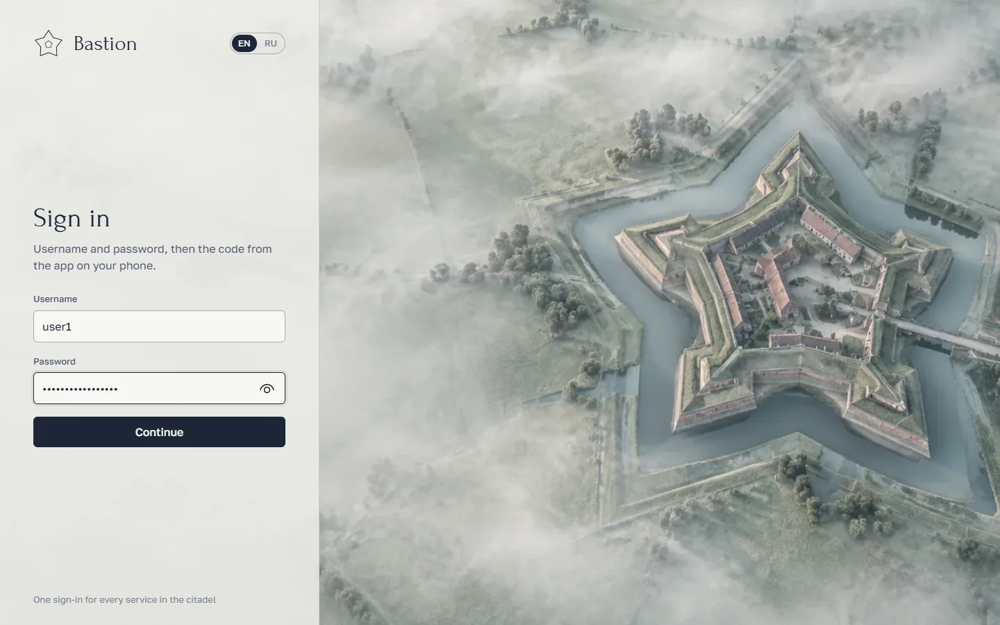
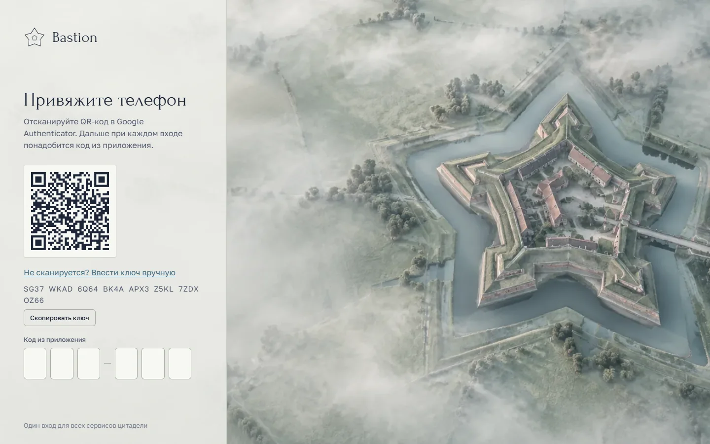
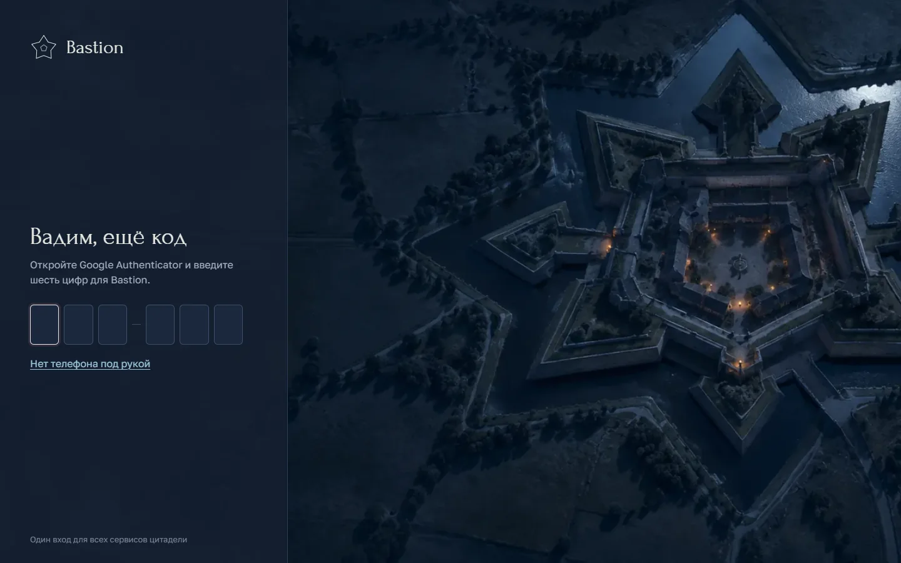
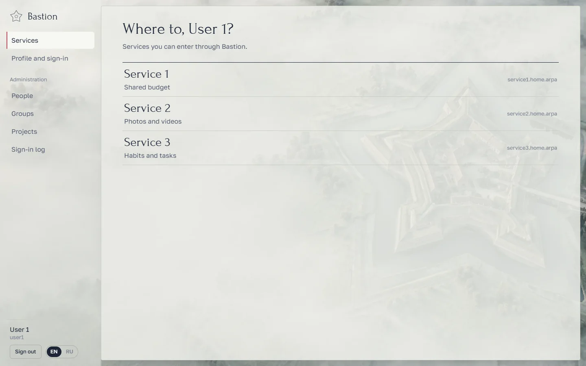
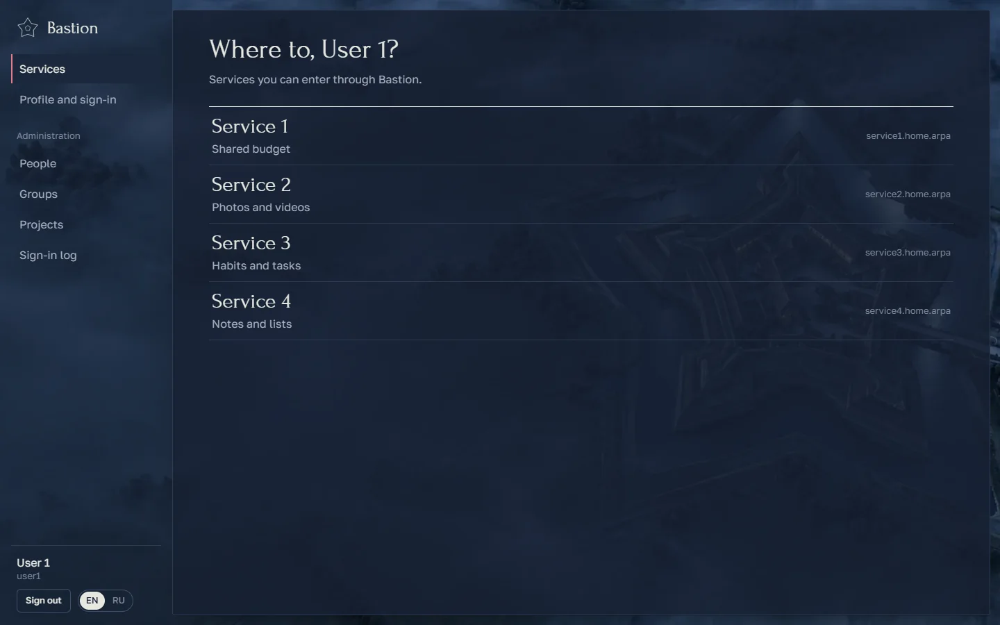
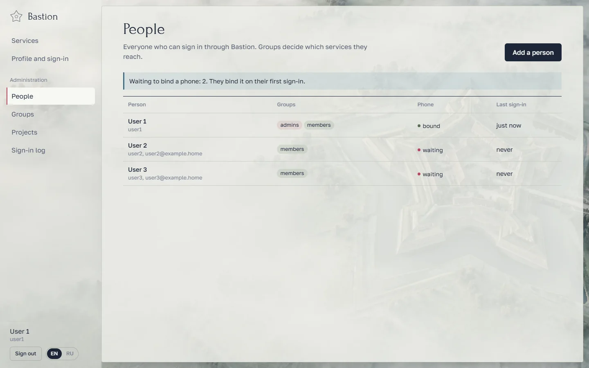
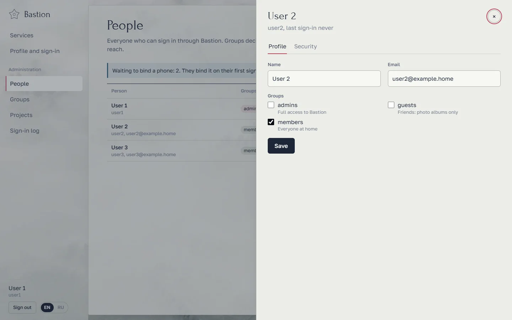
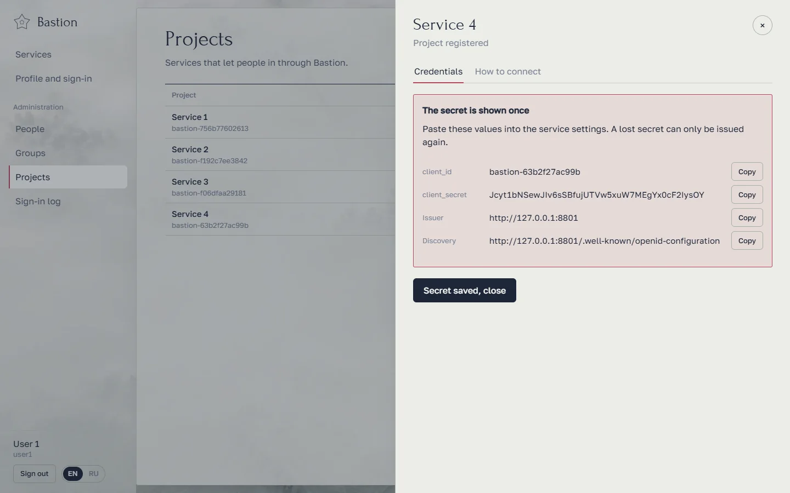
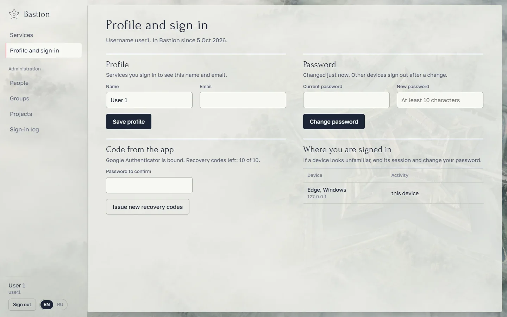
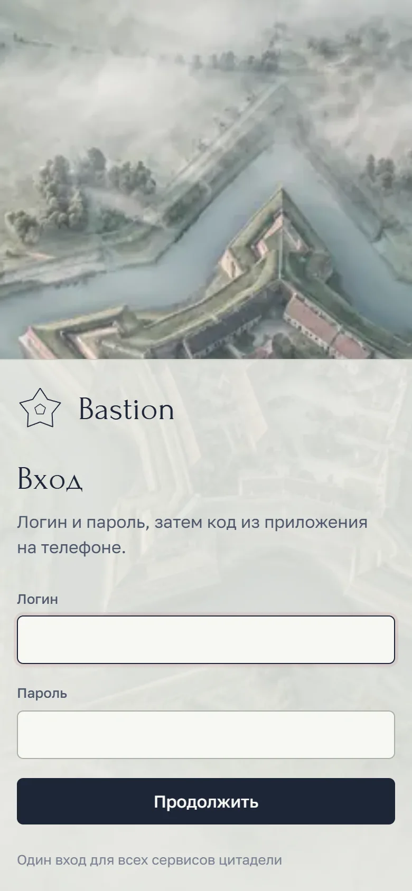

# Bastion

A small, self-hosted sign-in service for a home server. Create people, groups and projects once; people bind
their phone once; after that every service signs them in with a username, a password and a code from Google
Authenticator.



## What it does

- **People and groups.** Add a person, set a password, assign groups, disable sign-in, unbind a phone, end
  every session. A group works as a pass: give a project some groups and only their members get in.
- **A code from the app for everyone.** On the first sign-in Bastion shows a QR code for Google Authenticator
  (or any TOTP app) and hands out ten recovery codes in case the phone is lost.
- **Projects.** Register a service and get a `client_id` and a secret. Two ways to connect it:
  - **OIDC** ("Sign in with Bastion") for Immich and anything that speaks OpenID Connect;
  - **the project's own sign-in form**: its backend sends the username, password and code to Bastion.
- **A home page for people** listing the services they can enter.
- **Sign-in log**: who signed in, when and from where, failed attempts, settings changes.
- **English and Russian**, switchable on every page.
- **Light and dark themes** with matching dawn and night wallpapers. The two renders are aligned to a fraction
  of a pixel, so switching themes cross-fades the light over the same scene.
- **Fits the window.** Every screen fits a 100% zoom browser window from 1280×610 up, no scrolling; long lists
  page by the number of rows that fit.

| | |
|---|---|
|  |  |
|  |  |
|  |  |
|  |  |

<p align="center"></p>

## Security

- Passwords are hashed with **argon2id**; TOTP secrets are encrypted at rest (Fernet, key in `data/keys/`).
- Brute-force protection: 5 failures per username or 25 per IP within 15 minutes lock attempts for 15 minutes.
  Counters live in the database and survive restarts.
- A TOTP code cannot be reused; after 5 wrong codes the sign-in starts over.
- Server-side sessions; the cookie holds only a random token (HttpOnly, SameSite=Lax). State-changing requests
  require the `X-Bastion` header, which blocks CSRF.
- OIDC: authorization code flow, PKCE (S256), RS256-signed tokens, exact redirect URI match, single-use codes
  valid for 60 seconds.
- Strict headers (CSP, `frame-ancestors 'none'`); the container runs as non-root with a read-only filesystem
  and no capabilities.

> Out of the box Bastion speaks plain HTTP for a home network. Before exposing it to the internet, put it behind
> HTTPS (Caddy, Traefik…) and set `BASTION_COOKIE_SECURE=true`.

## Running

```sh
cp .env.example .env        # set the address, port and data directory
mkdir -p /srv/bastion-auth/data
docker compose up -d --build
docker logs bastion-auth    # prints the setup key for the first administrator
```

Open `BASTION_PUBLIC_URL`, enter the setup key and create the administrator. On the first sign-in Bastion asks
you to bind your phone.

`BASTION_PUBLIC_URL` is the OIDC issuer. Set it to exactly the address people and projects use, and avoid
changing it later: connected projects would need to be reconfigured.

Back up the whole `BASTION_DATA` directory: it holds the database (`bastion.db`) and the keys (`keys/`).
Without the keys TOTP secrets cannot be decrypted and everyone would have to bind their phone again.

Update after new commits:

```sh
git pull && docker compose up -d --build
```

## Connecting projects

Register the project under **Projects** first. The secret is shown once.

### OIDC (Immich and others)

In Immich: *Administration → Settings → OAuth*.

| Field | Value |
|---|---|
| Issuer URL | `http://bastion.home.arpa:8800` |
| Client ID / Secret | from Bastion |
| Scope | `openid email profile` |
| Button text | `Sign in with Bastion` |

In Bastion add the return addresses `http://<immich>/auth/login`, `http://<immich>/user-settings` and
`app.immich:///oauth-callback` (mobile app). Immich matches people by email, so fill in their email addresses.

Endpoints for any OIDC client: `/.well-known/openid-configuration`, `/oidc/authorize`, `/oidc/token`,
`/oidc/userinfo`, `/oidc/jwks`, `/oidc/logout`. Claims: `sub`, `preferred_username`, `name`, `email`, `groups`.

### The project's own sign-in form

The project backend checks a person with one request:

```http
POST /api/v1/authenticate
Authorization: Basic base64(client_id:client_secret)
X-Bastion-End-User-IP: <the person's IP>
Content-Type: application/json

{"username": "user2", "password": "…", "totp_code": "123456"}
```

`200` returns `{"user": {"id", "username", "display_name", "email", "groups", "is_active"}}`. Errors come in
`detail.code`: `invalid_credentials`, `totp_required`, `invalid_totp`, `totp_not_enrolled`, `access_denied`,
`locked` (with `retry_after`). Store `user.id` on your side, not the username.

`GET /api/v1/users` lists everyone allowed into the project; `GET /api/v1/users/{id}` returns one person.

A dependency-free Python client: [`clients/python/bastion_auth_client.py`](clients/python/bastion_auth_client.py).

## Development

```sh
python -m venv .venv && .venv/bin/pip install -e "backend[dev]"
cd backend && ../.venv/bin/pytest            # backend tests
BASTION_DATA_DIR=../data ../.venv/bin/uvicorn app.main:app --port 8800

cd frontend && npm install && npm run dev    # UI on :5173, API proxied to :8800
```

Stack: FastAPI, SQLAlchemy, Alembic, SQLite, React, Vite.

Tooling in `scripts/` (Playwright with the installed Microsoft Edge, run against a fresh instance):

- `screenshots.py` captures the README screenshots;
- `fit_check.py` walks every screen at common window sizes and reports anything that scrolls.

Wallpapers were generated with Codex `imagegen`; the night render was produced as a relighting edit of the dawn
one and then aligned with OpenCV ECC (median residual 0.23 px). Fonts: Forum and Golos Text.
